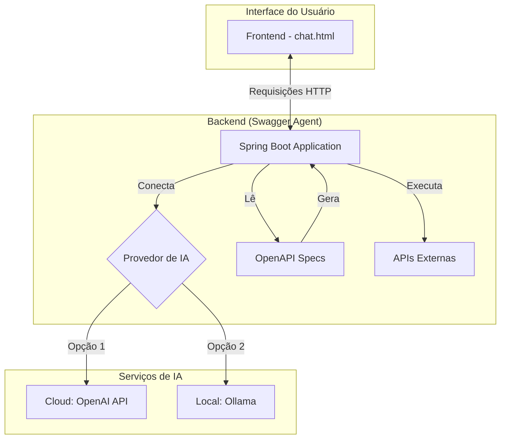

# 🤖 Swagger Agent

[](https://openjdk.java.net/projects/jdk/21/)
[](https://spring.io/projects/spring-boot)
[](https://spring.io/projects/spring-ai)
[](LICENSE)
[](https://cesarschutz.github.io/swagger-agent/)

<p align="center">
  
</p>

<p align="center">
  <strong>Transforme qualquer especificação OpenAPI em ferramentas dinâmicas que podem ser invocadas por modelos de linguagem (LLMs).</strong>
</p>

<p align="center">
  Construído com <strong>Spring Boot 3</strong>, <strong>Spring AI</strong> e preparado para rodar com <strong>OpenAI</strong> ou <strong>modelos locais via Ollama</strong>.
</p>

<p align="center">
  <a href="https://cesarschutz.github.io/swagger-agent/">📚 Documentação Completa</a>
</p>

## 📑 Índice

- [✨ Funcionalidades](#-funcionalidades)
- [🚀 Quick Start](#-quick-start)
- [🏗️ Arquitetura](#️-arquitetura)
- [🤖 Configuração de Provedores de IA](#-configuração-de-provedores-de-ia)
- [🧑‍💻 Usando com Modelo Local](#-usando-com-modelo-local-ollama)
- [📚 API Reference](#-api-reference)
- [🔧 Configuração](#-configuração)
- [🤝 Contribuindo](#-contribuindo)
- [📄 Licença](#-licença)

## ✨ Funcionalidades

### 🚀 Chat Inteligente
- Comunicação natural com modelos da OpenAI ou LLMs locais via `/api/chat`
- Memória de sessão para manter contexto entre conversas
- **Suporte a múltiplos provedores de IA**: OpenAI e Ollama com troca fácil via configuração

### 🖥️ Interface Web Moderna

<div align="center">
  <div style="margin-bottom: 2rem;">
    <h4>🖥️ Desktop</h4>
    
  </div>
  
  <div>
    <h4>📱 Mobile</h4>
    
  </div>
</div>

- **🎨 Design Moderno**: Interface com gradientes, efeitos glass e animações suaves
- **🛠️ Painel de Ferramentas**: Visualize todas as APIs disponíveis organizadas por projeto
- **💬 Chat Inteligente**: Conversa natural com suporte a markdown e emojis
- **📱 Responsivo**: Funciona perfeitamente em desktop, tablet e mobile
- **⚡ Tempo Real**: Indicadores de digitação e atualizações instantâneas

### 🛠️ Ferramentas Dinâmicas
- Geração automática de functions a partir de arquivos OpenAPI
- Execução assíncrona para melhor responsividade
- Logs estruturados para auditoria

## 🚀 Quick Start (Usando OpenAI)

Siga os passos abaixo para executar o projeto com a configuração padrão (OpenAI).

### 📋 Pré-requisitos
- **Java 21** ou superior
- **Maven 3.6+**
- **OpenAI API Key**

### ⚡ Execução

1.  **Clone o repositório:**
    ```bash
    git clone https://github.com/cesarschutz/swagger-agent.git
    cd swagger-agent
    ```

2.  **Adicione seus arquivos OpenAPI:**
    - Coloque seus arquivos de especificação (`.json` ou `.yaml`) na pasta `openapi-specs/`. Por padrão, o projeto já inclui um exemplo do Petstore.

3.  **Configure sua chave da OpenAI:**
    ```bash
    export OPENAI_API_KEY="sua_chave_openai_aqui"
    ```

4.  **Execute a aplicação:**
    ```bash
    ./mvnw spring-boot:run
    ```

5.  **Acesse a interface:**
    - Abra seu navegador em [http://localhost:8080/chat.html](http://localhost:8080/chat.html).

>💡 **Quer usar um modelo local?** Pule para a seção [Configurando o Provedor de IA](#-configurando-o-provedor-de-ia) para ver como usar o **Ollama**.

## 🤖 Configurando o Provedor de IA

O Swagger Agent foi projetado para ser flexível, permitindo que você alterne facilmente entre a **OpenAI** (padrão, baseado em nuvem) e o **Ollama** (para executar modelos de linguagem localmente). A seleção é controlada pela propriedade `app.ai.provider` no arquivo `application.yml` ou pela variável de ambiente `AI_PROVIDER`.

Apenas um provedor de IA é carregado em tempo de execução, garantindo que não haja sobrecarga ou conflitos.

---

### Opção 1: Usar OpenAI (Padrão)

Ideal para uma configuração rápida e para usar os modelos mais avançados disponíveis no mercado, exigindo apenas uma chave de API.

**1. Configure a Chave de API**
```bash
export OPENAI_API_KEY="sua_chave_openai_aqui"
```

**2. Defina o Provedor (Opcional)**
A propriedade já vem configurada por padrão para `openai`. Se precisar definir explicitamente:
```bash
# Via variável de ambiente
export AI_PROVIDER=openai

# Ou no application.yml
app:
  ai:
    provider: openai
```

**3. Execute**
```bash
./mvnw spring-boot:run
```

---

### Opção 2: Usar Modelo Local com Ollama

Perfeito para desenvolvimento offline, privacidade de dados ou para experimentar uma vasta gama de modelos de código aberto.

**1. Instale e Execute o Ollama**
A maneira mais fácil é usando Docker:
```bash
docker run -d --rm -p 11434:11434 --name ollama ollama/ollama
```

**2. Baixe um Modelo**
Você precisa ter pelo menos um modelo baixado. Exemplo com `qwen2.5:0.5b`:
```bash
docker exec -it ollama ollama pull qwen2.5:0.5b
```

**3. Configure a Aplicação**
Informe à aplicação para usar o Ollama. Você pode usar variáveis de ambiente (mais comum para dados sensíveis ou que mudam com frequência) ou editar diretamente o `application.yml`.

*   **Método 1: Variáveis de Ambiente**
    ```bash
    export AI_PROVIDER=ollama
    export SPRING_AI_OLLAMA_CHAT_OPTIONS_MODEL="qwen2.5:0.5b"
    export SPRING_AI_OLLAMA_BASE_URL=http://localhost:11434
    ```

*   **Método 2: `application.yml`**
    ```yaml
    app:
      ai:
        provider: ollama
    spring:
      ai:
        ollama:
          base-url: http://localhost:11434
          chat:
            options:
              model: "qwen2.5:0.5b"
    ```

**4. Execute**
```bash
./mvnw spring-boot:run
```
> **Importante:** Lembre-se de reiniciar a aplicação sempre que trocar o provedor de IA.

## 🏗️ Arquitetura

O Swagger Agent funciona como uma ponte entre uma interface de chat, um modelo de linguagem e suas APIs existentes.



## 📚 API Reference

| Método | Endpoint         | Descrição                                                                              |
|--------|------------------|----------------------------------------------------------------------------------------|
| `POST` | `/api/chat`      | Envia uma mensagem para o chat. A resposta é síncrona.                                 |
| `POST` | `/api/chat/stream` | Envia uma mensagem e recebe a resposta em tempo real (streaming via Server-Sent Events). |
| `GET`  | `/api/tools`     | Lista todas as ferramentas dinâmicas geradas a partir das especificações OpenAPI.      |

### Exemplo: Chamada de Chat

```bash
curl -X POST http://localhost:8080/api/chat \
  -H "Content-Type: application/json" \
  -d '{
    "message": "Quais pets estão disponíveis para venda?",
    "sessionId": "conversa-unica-123"
  }'
```

## 🔧 Configuração Avançada

A tabela abaixo resume as principais variáveis de ambiente que você pode usar para personalizar a aplicação.

| Variável                              | Descrição                                                | Padrão                   |
|---------------------------------------|------------------------------------------------------------|--------------------------|
| `AI_PROVIDER`                         | Define o provedor de IA a ser usado (`openai` ou `ollama`). | `openai`                 |
| `OPENAI_API_KEY`                      | Sua chave de API da OpenAI.                                | N/A                      |
| `SPRING_AI_OLLAMA_BASE_URL`           | A URL base onde o servidor Ollama está rodando.            | `http://localhost:11434` |
| `SPRING_AI_OLLAMA_CHAT_OPTIONS_MODEL` | O nome do modelo que o Ollama deve usar para o chat.       | `qwen2.5:0.5b`             |

## 🤝 Contribuindo

Contribuições são bem-vindas! Se você tiver ideias para novas funcionalidades, melhorias ou correções de bugs, sinta-se à vontade para:

1.  Fazer um **fork** do repositório.
2.  Criar uma nova **branch** (`git checkout -b feature/sua-feature`).
3.  Fazer **commit** de suas mudanças (`git commit -m 'Adiciona nova feature'`).
4.  Fazer **push** para a branch (`git push origin feature/sua-feature`).
5.  Abrir um **Pull Request**.

## 📄 Licença

Este projeto está licenciado sob a [Licença MIT](LICENSE).

---

### 🔗 Links Úteis

- [📚 Documentação](https://cesarschutz.github.io/swagger-agent/)
- [💻 Código Fonte](https://github.com/cesarschutz/swagger-agent)
- [🎮 Interface Demo](https://cesarschutz.github.io/swagger-agent/demo-chat.html)
