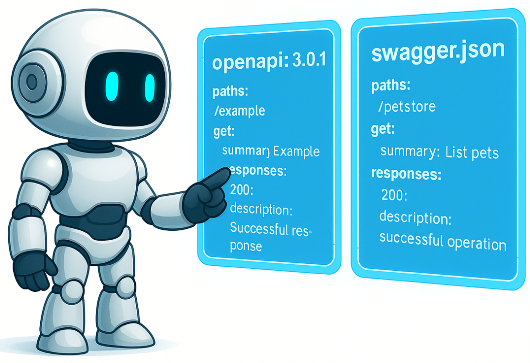
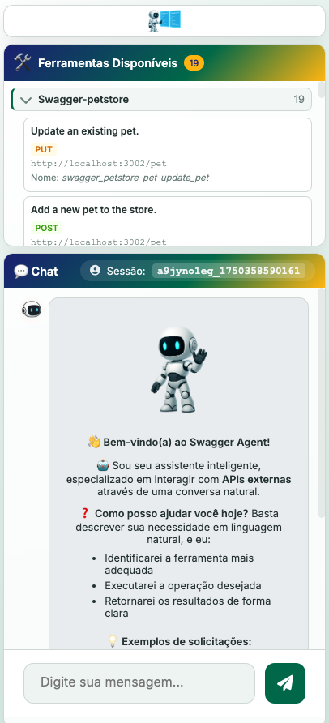
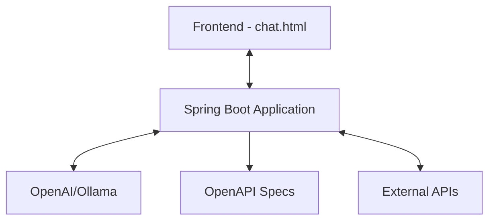

# 🤖 Swagger Agent

[](https://openjdk.java.net/projects/jdk/21/)
[](https://spring.io/projects/spring-boot)
[](https://spring.io/projects/spring-ai)
[](LICENSE)
[](https://cesarschutz.github.io/swagger-agent/)

<p align="center">
  
</p>

<p align="center">
  <strong>Transforme qualquer especificação OpenAPI em ferramentas dinâmicas que podem ser invocadas por modelos de linguagem (LLMs).</strong>
</p>

<p align="center">
  Construído com <strong>Spring Boot 3</strong>, <strong>Spring AI</strong> e preparado para rodar com <strong>OpenAI</strong> ou <strong>modelos locais via Ollama</strong>.
</p>

<p align="center">
  <a href="https://cesarschutz.github.io/swagger-agent/">📚 Documentação Completa</a>
</p>

## 📑 Índice

- [✨ Funcionalidades](#-funcionalidades)
- [🚀 Quick Start](#-quick-start)
- [🏗️ Arquitetura](#️-arquitetura)
- [🤖 Configuração de Provedores de IA](#-configuração-de-provedores-de-ia)
- [🧑‍💻 Usando com Modelo Local](#-usando-com-modelo-local-ollama)
- [📚 API Reference](#-api-reference)
- [🔧 Configuração](#-configuração)
- [🤝 Contribuindo](#-contribuindo)
- [📄 Licença](#-licença)

## ✨ Funcionalidades

### 🚀 Chat Inteligente
- Comunicação natural com modelos da OpenAI ou LLMs locais via `/api/chat`
- Memória de sessão para manter contexto entre conversas
- **Suporte a múltiplos provedores de IA**: OpenAI e Ollama com troca fácil via configuração

### 🖥️ Interface Web Moderna

<div align="center">
  <div style="margin-bottom: 2rem;">
    <h4>🖥️ Desktop</h4>
    
  </div>
  
  <div>
    <h4>📱 Mobile</h4>
    
  </div>
</div>

- **🎨 Design Moderno**: Interface com gradientes, efeitos glass e animações suaves
- **🛠️ Painel de Ferramentas**: Visualize todas as APIs disponíveis organizadas por projeto
- **💬 Chat Inteligente**: Conversa natural com suporte a markdown e emojis
- **📱 Responsivo**: Funciona perfeitamente em desktop, tablet e mobile
- **⚡ Tempo Real**: Indicadores de digitação e atualizações instantâneas

### 🛠️ Ferramentas Dinâmicas
- Geração automática de functions a partir de arquivos OpenAPI
- Execução assíncrona para melhor responsividade
- Logs estruturados para auditoria

## 🚀 Quick Start

### 📋 Pré-requisitos

- Java 21 ou superior
- Maven 3.6+
- OpenAI API Key (se usar OpenAI) ou Ollama (se usar modelo local)

### ⚡ Instalação

1. Clone o repositório:
```bash
git clone https://github.com/cesarschutz/swagger-agent.git
cd swagger-agent
```

2. Adicione suas especificações OpenAPI:
- Coloque seus arquivos `.json` ou `.yaml` na pasta `openapi-specs/`
- Exemplo incluído: `openapi-specs/petstore/petstore.yaml`

3. Configure o provedor de IA (veja seção [Configuração de Provedores de IA](#-configuração-de-provedores-de-ia))

4. Execute a aplicação:
```bash
./mvnw spring-boot:run
```

5. Acesse a interface web:
```
http://localhost:8080/chat.html
```

## 🏗️ Arquitetura



### 📁 Estrutura do Projeto

```
src/
├── main/
│   ├── java/com/example/swaggeragent/
│   │   ├── controller/     # Controllers REST
│   │   ├── service/        # Lógica de Negócio
│   │   ├── model/          # Modelos de Dados
│   │   ├── dto/            # DTOs da API
│   │   └── config/         # Configurações
│   └── resources/
│       ├── static/         # Frontend
│       └── application.yml # Configurações
└── openapi-specs/          # Especificações OpenAPI
```

## 🤖 Configuração de Provedores de IA

O Swagger Agent suporta múltiplos provedores de IA com configuração simples. Apenas **um provedor será carregado por vez**, definido pela propriedade `app.ai.provider`.

### 🔧 Propriedade de Configuração

```yaml
app:
  ai:
    provider: ${AI_PROVIDER:openai}  # Valores: "openai" ou "ollama"
```

### 🚀 OpenAI (Padrão)

**Configuração:**
```bash
# Via variável de ambiente
export AI_PROVIDER=openai
export OPENAI_API_KEY="sua_chave_openai_aqui"

# Ou no application.yml
app:
  ai:
    provider: openai
```

**Requisitos:**
- Chave da API OpenAI configurada
- Conexão com internet

### 🏠 Ollama (Modelo Local)

**Configuração:**
```bash
# Via variável de ambiente
export AI_PROVIDER=ollama
export SPRING_AI_OLLAMA_BASE_URL=http://localhost:11434
export SPRING_AI_OLLAMA_CHAT_OPTIONS_MODEL="qwen2.5:0.5b"

# Ou no application.yml
app:
  ai:
    provider: ollama
```

**Requisitos:**
- Servidor Ollama rodando
- Modelo baixado no Ollama

### 🔄 Troca de Provedores

Para trocar entre provedores, simplesmente altere a propriedade `app.ai.provider`:

```bash
# Usar OpenAI
export AI_PROVIDER=openai

# Usar Ollama
export AI_PROVIDER=ollama
```

**Importante:** A aplicação deve ser reiniciada após alterar o provedor.

## 🧑‍💻 Usando com Modelo Local (Ollama)

### 1. Inicie o Ollama
```bash
docker run -d --name ollama -p 11434:11434 ollama/ollama:latest
```

### 2. Baixe um modelo
```bash
docker exec -it ollama ollama pull qwen2.5:0.5b
```

### 3. Configure o ambiente
```bash
export AI_PROVIDER=ollama
export SPRING_AI_OLLAMA_BASE_URL=http://localhost:11434
export SPRING_AI_OLLAMA_CHAT_OPTIONS_MODEL="qwen2.5:0.5b"
```

### 4. Execute a aplicação
```bash
./mvnw spring-boot:run
```

## 📚 API Reference

### Endpoints

| Método | Endpoint | Descrição |
|--------|----------|-----------|
| `POST` | `/api/chat` | Chat síncrono |
| `POST` | `/api/chat/stream` | Chat com streaming |
| `GET`  | `/api/tools` | Lista ferramentas |

### Exemplo de Uso

```bash
# Chat síncrono
curl -X POST http://localhost:8080/api/chat \
  -H "Content-Type: application/json" \
  -d '{
    "message": "Quais pets estão disponíveis?",
    "sessionId": "sessao-123"
  }'
```

## 🔧 Configuração

### Variáveis de Ambiente

| Variável | Descrição | Padrão |
|----------|-----------|--------|
| `AI_PROVIDER` | Provedor de IA a ser utilizado | `openai` |
| `OPENAI_API_KEY` | Chave da API OpenAI | - |
| `SPRING_AI_OLLAMA_BASE_URL` | URL base do Ollama | `http://localhost:11434` |
| `SPRING_AI_OLLAMA_CHAT_OPTIONS_MODEL` | Modelo do Ollama | `qwen2.5:0.5b` |

### application.yml
```yaml
# Configuração do provedor de IA
app:
  ai:
    provider: ${AI_PROVIDER:openai}  # "openai" ou "ollama"

# Configurações OpenAI
spring:
  ai:
    openai:
      api-key: ${OPENAI_API_KEY}
      chat:
        options:
          model: gpt-4o-mini
          temperature: 0.7
          max-tokens: 2048

# Configurações Ollama
spring:
  ai:
    ollama:
      base-url: ${SPRING_AI_OLLAMA_BASE_URL:http://localhost:11434}
      chat:
        options:
          model: ${SPRING_AI_OLLAMA_CHAT_OPTIONS_MODEL:qwen2.5:0.5b}
          temperature: 0.7
```

## 🤝 Contribuindo

1. Faça um Fork do projeto
2. Crie sua Feature Branch (`git checkout -b feature/AmazingFeature`)
3. Commit suas mudanças (`git commit -m 'Add some AmazingFeature'`)
4. Push para a Branch (`git push origin feature/AmazingFeature`)
5. Abra um Pull Request

## 📄 Licença

Este projeto está sob a licença MIT. Veja o arquivo [LICENSE](LICENSE) para mais detalhes.

---

### 🔗 Links Úteis

- [📚 Documentação](https://cesarschutz.github.io/swagger-agent/)
- [💻 Código Fonte](https://github.com/cesarschutz/swagger-agent)
- [🎮 Interface Demo](https://cesarschutz.github.io/swagger-agent/demo-chat.html)
