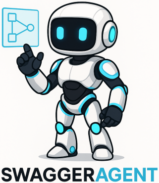

<p align="center">
  
</p>

# Swagger Agent 🤖

Um projeto de assistente de IA que utiliza o poder do Spring AI para interagir de forma inteligente com APIs RESTful. Este agente funciona como uma interface de conversação para um backend, permitindo que os usuários façam solicitações em linguagem natural que são traduzidas em chamadas de API.

## ✨ Funcionalidades

- **Inteligência Artificial com Spring AI:** Integração com modelos de linguagem avançados (testado com OpenAI) para entender e processar as solicitações dos usuários.
- **Chamada de Funções (Tools):** O agente mapeia as solicitações de linguagem natural para ferramentas específicas que correspondem a endpoints de API, permitindo consultar dados e executar ações.
- **Raciocínio Condicional:** Lógica de prompt aprimorada que permite ao agente realizar operações em etapas (ex: "consulte o status do cartão e, se estiver ativo, bloqueie-o").
- **Interface de Chat Moderna:** Uma interface web elegante (`chat2.html`) para interagir com o agente, incluindo renderização de Markdown e avatares.

## 🛠️ Tecnologias Utilizadas

- **Backend:** Java 17, Spring Boot 3.2.3, Spring AI (OpenAI Starter)
- **Frontend:** HTML5, CSS3, JavaScript
- **Build:** Apache Maven

## ⚙️ Configuração do Ambiente

Antes de executar o projeto, você precisa configurar duas coisas principais: sua chave de API da OpenAI e as APIs de backend simuladas.

### 1. Chave da API OpenAI

O projeto está configurado para ler sua chave da API OpenAI a partir de uma variável de ambiente.

**Como configurar:**

- **Linux/macOS:**
  ```bash
  export OPENAI_API_KEY='sua_chave_de_api_aqui'
  ```
- **Windows (PowerShell):**
  ```powershell
  $env:OPENAI_API_KEY="sua_chave_de_api_aqui"
  ```

Substitua `sua_chave_de_api_aqui` pela sua chave real da OpenAI.

### 2. APIs Simuladas (Mock)

O agente foi projetado para interagir com APIs de Cartão e Fatura. O projeto espera que essas APIs estejam rodando em `http://localhost:3000`.

Uma maneira fácil de simular essas APIs é usando o `json-server`.

**Como configurar e executar o servidor mock:**

1.  **Instale o `json-server`** (requer Node.js):
    ```bash
    npm install -g json-server
    ```

2.  **Crie um arquivo `db.json`** na raiz de um diretório de sua escolha com o seguinte conteúdo:
    ```json
    {
      "cards": [
        {
          "uuid": "333",
          "productName": "Cartão Gold",
          "lastFourNumbers": "1234",
          "status": {
            "type": "BLOQUEADO"
          }
        }
      ],
      "invoices": []
    }
    ```

3.  **Inicie o `json-server`:**
    ```bash
    json-server --watch db.json
    ```
    Isso iniciará um servidor em `http://localhost:3000` que responde às chamadas que o agente fará.

## 🚀 Como Executar o Projeto

Com a variável de ambiente `OPENAI_API_KEY` configurada e o `json-server` (ou sua própria implementação de backend) rodando, você pode iniciar a aplicação Spring Boot.

1.  **Navegue até a raiz do projeto** no seu terminal.
2.  **Execute o comando Maven:**
    ```bash
    ./mvnw spring-boot:run
    ```
3.  **Abra a interface do chat** no seu navegador:
    [http://localhost:8080/chat.html](http://localhost:8080/chat2.html)

## 💬 Exemplos de Comandos

Você pode interagir com o agente usando linguagem natural. Tente os seguintes comandos:

- `Consulte os dados do cartão 333`
- `Qual é o status do cartão 333?`
- `Consulte o cartão 333 e, se o status for ATIVO, bloqueie o cartão`